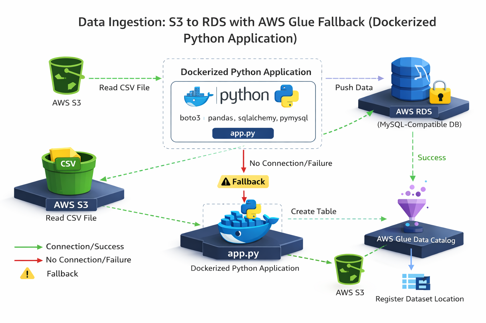
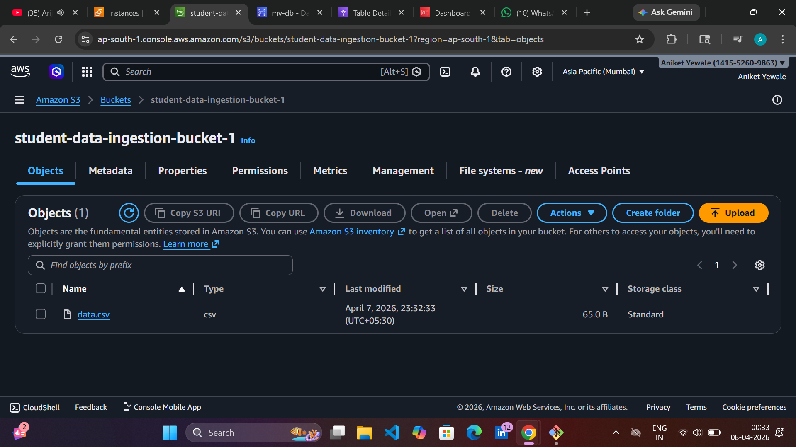
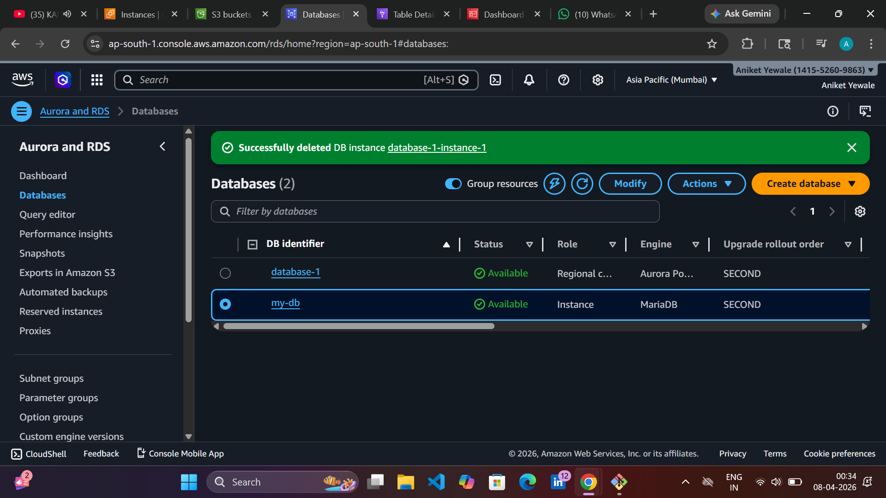
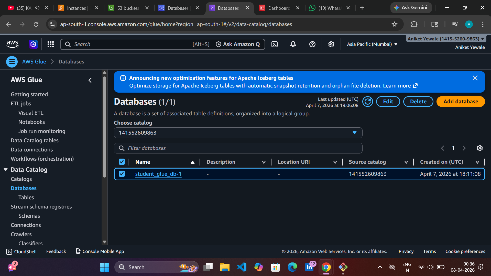
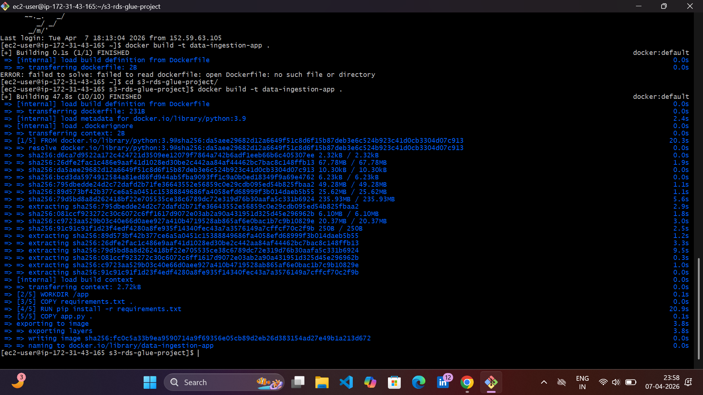
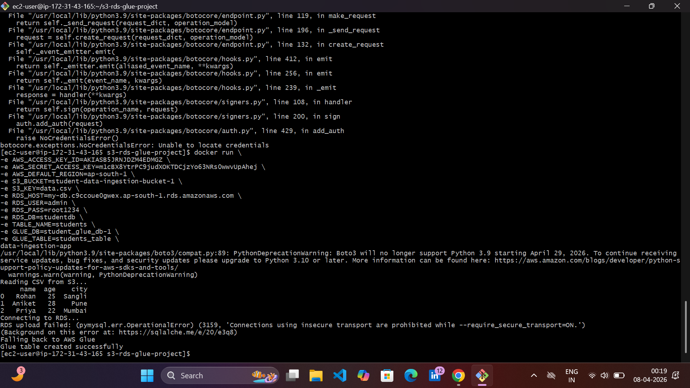
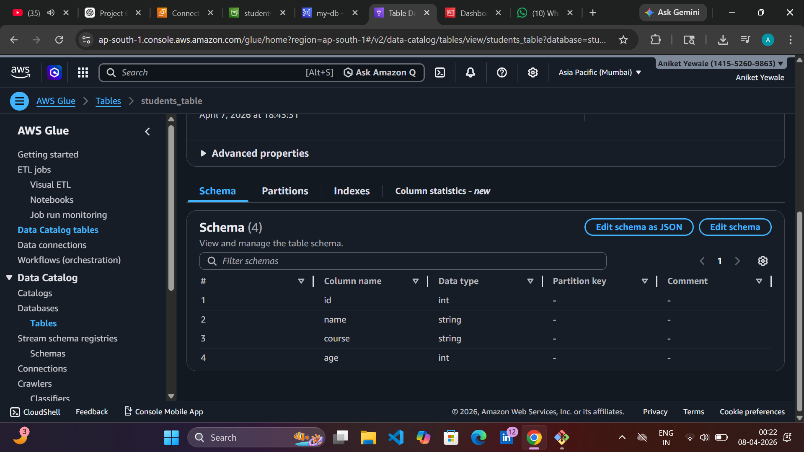

# Data Ingestion from S3 to RDS with AWS Glue Fallback (Dockerized Python Application)

## Project Overview

This project demonstrates how to build a Dockerized Python application that reads a CSV file from Amazon S3 and inserts the data into an Amazon RDS MySQL database. If the RDS database is unavailable or the data insertion fails, the application automatically falls back to AWS Glue to create a table in the Glue Data Catalog.

This project integrates multiple AWS services and demonstrates a fault-tolerant data ingestion pipeline.

---

## AWS Services Used

* Amazon S3
* Amazon RDS (MySQL)
* AWS Glue
* AWS IAM
* Amazon EC2
* Docker

---

## Architecture

S3 Bucket → Dockerized Python Application → Amazon RDS
If RDS fails → AWS Glue Fallback


---

## Project Structure

```
s3-rds-glue-project
│
├── app.py
├── Dockerfile
├── requirements.txt
├── global-bundle.pem
├── data.csv
└── README.md
```

---

## Prerequisites

Before running this project ensure you have:

* AWS Account
* EC2 Instance
* Docker Installed
* AWS Access Key & Secret Key
* S3 Bucket
* RDS MySQL Instance
* AWS Glue Database

---

## Step 1 – Create S3 Bucket

Create a bucket in S3 and upload a CSV file.

Example CSV:

```
name,age,course
Rohan,25,MCA
Aniket,28,JAVA
Priya,22,PYTHON
```

Upload the file as:

```
data.csv
```

---

## Step 2 – Create RDS Database

Create a MySQL RDS instance and create a database.

Example:

```
Database Name: my-db
Table Name: students
```

---

## Step 3 – Create AWS Glue Database

Go to AWS Glue → Data Catalog → Databases

Create database:

```
student_glue_db
```

---

## Step 4 – Create Project Folder

```
mkdir s3-rds-glue-project
cd s3-rds-glue-project
```

---

## Step 5 – Create requirements.txt

```
pandas
boto3
pymysql
sqlalchemy
```

---

## Step 6 – Download RDS SSL Certificate

```
wget https://truststore.pki.rds.amazonaws.com/global/global-bundle.pem
```

---

## Step 7 – Dockerfile

```
FROM python:3.9

WORKDIR /app

COPY requirements.txt .

RUN pip install -r requirements.txt

COPY app.py .

COPY global-bundle.pem .

CMD ["python","app.py"]
```

---

## Step 8 – Build Docker Image

```
docker build -t data-ingestion-app .
```

---

## Step 9 – Run Docker Container

```
docker run \
-e AWS_ACCESS_KEY_ID=YOUR_ACCESS_KEY
-e AWS_SECRET_ACCESS_KEY=YOUR_SECRET_KEY
-e AWS_DEFAULT_REGION=ap-south-1 \
-e S3_BUCKET=student-data-ingestion-bucket-1 \
-e S3_KEY=data.csv \
-e RDS_HOST=your endpoint \
-e RDS_USER=admin \
-e RDS_PASS=root1234 \
-e RDS_DB=studentdb \
-e TABLE_NAME=students \
-e GLUE_DB=student_glue_db-1 \
-e GLUE_TABLE=students_table \
data-ingestion-app
```

---

## Application Workflow

1. Python application reads CSV from S3.
2. Data is loaded into a Pandas DataFrame.
3. Application attempts to insert data into RDS MySQL table.
4. If RDS fails, the application switches to AWS Glue fallback.
5. AWS Glue creates a table in the Data Catalog.

---

## Expected Output

Successful execution:

```
Reading CSV from S3...
Connecting to RDS...
Data successfully inserted into RDS
```

If RDS fails:

```
RDS upload failed
Falling back to AWS Glue
Glue table created successfully
```

---

## Verify Data in Glue


Example Output:

| name   | age | course   |
| ------ | --- | ------ |
| Rohan  | 25  | MCA |
| Aniket | 28  | JAVA   |
| Priya  | 22  | PYTHON |


---

## Key Features

* Automated data ingestion pipeline
* Fault tolerant architecture
* Dockerized Python application
* Integration with AWS services
* Glue fallback mechanism

---

## Future Improvements

* Add CloudWatch logs
* Add Lambda triggers
* Add Airflow orchestration
* Implement data validation

---

## Author

Aniket Yewale
Cloud & DevOps Learner
